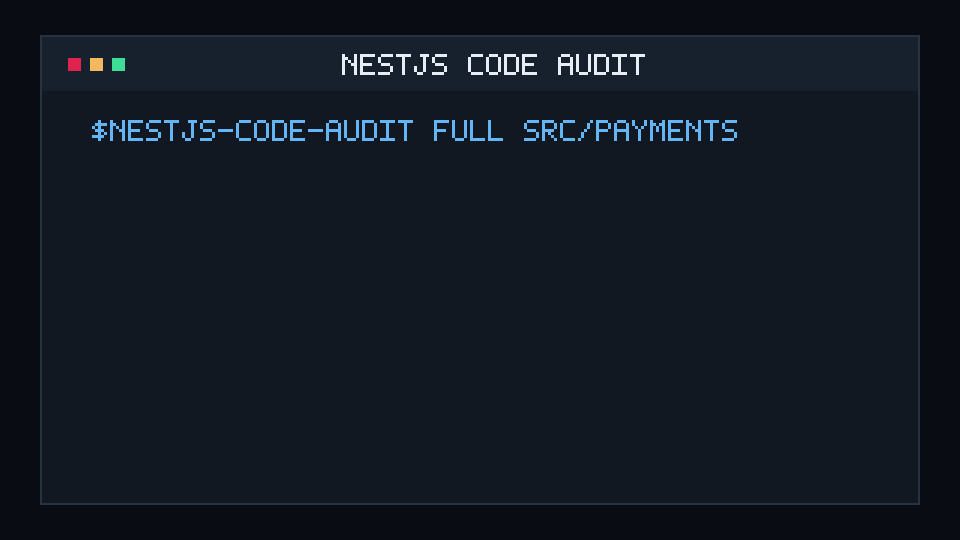
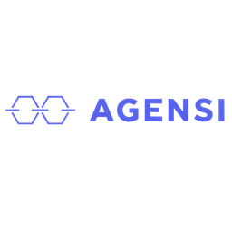

<div align="center">
  <picture>
    <source media="(prefers-color-scheme: dark)" srcset="docs/public/brand/nestjs-skills-mark-dark.svg">
    <source media="(prefers-color-scheme: light)" srcset="docs/public/brand/nestjs-skills-mark-light.svg">
    
  </picture>

  <h1>NestJS Skills</h1>

  <p><strong>Thoughtful engineering guidance for agents that work on real NestJS codebases.</strong></p>
  <p>Build, audit, refactor, scale, and publish with clear ownership—without turning every project into accidental architecture.</p>

  <p>
    <a href="https://github.com/amirtaherkhani/nestjs-skills/actions/workflows/validate.yml"></a>
    <a href="https://github.com/amirtaherkhani/nestjs-skills/actions/workflows/deploy-pages.yml"></a>
    <a href="https://github.com/amirtaherkhani/nestjs-skills/releases/latest"></a>
    <a href="https://agentskills.io/specification"></a>
    <a href="LICENSE"></a>
  </p>

  <p>
    <a href="https://amirtaherkhani.github.io/nestjs-skills/"><strong>Documentation</strong></a>
    ·
    <a href="https://amirtaherkhani.github.io/nestjs-skills/guide/getting-started">Getting started</a>
    ·
    <a href="https://amirtaherkhani.github.io/nestjs-skills/guide/choose-a-skill">Choose a skill</a>
    ·
    <a href="https://amirtaherkhani.github.io/nestjs-skills/guide/feature-audit">Feature audit</a>
    ·
    <a href="https://amirtaherkhani.github.io/nestjs-skills/rules/">Rules reference</a>
  </p>
</div>

---

<p align="center">
  
</p>

<p align="center"><sub>A read-only audit turns TypeScript, lint, architecture, design, security, testing, and production evidence into one prioritized report.</sub></p>

## ✨ What is this?

This repository contains **seven focused Agent Skills** for Claude Code, Codex, and other clients that support the [Agent Skills open standard](https://agentskills.io/specification).

Each skill owns a distinct engineering decision. Together they help an agent inspect the actual repository, choose the smallest safe design, resolve conflicting instructions before mutation, and verify outcomes with evidence.

> [!TIP]
> **Latest release:** [`v2.2.0`](https://github.com/amirtaherkhani/nestjs-skills/releases/tag/v2.2.0) adds standalone Code Audit guidance, three runnable NestJS examples, and an opt-in evaluation harness. See the [changelog](CHANGELOG.md) for changes and verification limits.

> [!IMPORTANT]
> **Version 2 migration:** `professional-software-engineering` is now `nestjs-professional-software-engineering`, and `git-commit-pr-message` is now `nestjs-git-commit-pr-message`. Reinstall the renamed skills and update explicit commands so every skill in this NestJS collection uses the `nestjs-` prefix.

> [!NOTE]
> These skills do not force Clean Architecture, CQRS, repositories, microservices, Kubernetes, or design patterns into every project. The repository and its real constraints come first.

## 🧭 Pick the right skill

| | Skill | Reach for it when you need to… |
| --- | --- | --- |
| 🧠 | [`nestjs-professional-software-engineering`](skills/nestjs-professional-software-engineering/SKILL.md) | Implement a NestJS feature, fix, refactor, API, or library using clear version-compatible syntax and proportionate verification |
| 🏗️ | [`nestjs-architecture-principles`](skills/nestjs-architecture-principles/SKILL.md) | Decide module, capability, dependency, data, transaction, ORM, or service boundaries |
| 🧩 | [`nestjs-oop-design-patterns`](skills/nestjs-oop-design-patterns/SKILL.md) | Improve responsibilities, invariants, SOLID trade-offs, test seams, or pattern selection without over-engineering |
| ⚡ | [`nestjs-features-performance`](skills/nestjs-features-performance/SKILL.md) | Design errors, security, APIs, queues, caching, observability, delivery, performance, reliability, or scale |
| 🔎 | [`nestjs-code-audit`](skills/nestjs-code-audit/SKILL.md) | Audit a whole NestJS repository for static and semantic problems without modifying it |
| 🗺️ | [`nestjs-feature-audit`](skills/nestjs-feature-audit/SKILL.md) | Compare one feature on a named branch with its documented roadmap and classify implementation, gaps, legacy code, bugs, and blockers |
| 🚀 | [`nestjs-git-commit-pr-message`](skills/nestjs-git-commit-pr-message/SKILL.md) | Stage NestJS changes intentionally, scan for secrets, write commits and PRs, push safely, and follow CI or GitHub Pages |

### How they fit together

| Workflow | Recommended path |
| --- | --- |
| Build or change a feature | 🧠 Professional Engineering → 🏗️ Architecture → 🧩 Object Design → ⚡ Runtime → 🚀 Git Publication |
| Review the whole codebase | 🔎 Code Audit → one deduplicated, evidence-backed report |
| Validate a feature roadmap | 🗺️ Feature Audit → one branch-specific roadmap traceability report |
| Diagnose a focused problem | Start with the narrowest owning skill; add another only when the decision crosses boundaries |

Every skill carries a **pre-execution conflict guard**. If two active skills want incompatible file changes, commands, contracts, or architecture, the agent assigns one owner or stops for clarification before mutation.

## ⚡ Quick start

### 1. Install the collection

```bash
npx skills add amirtaherkhani/nestjs-skills
```

<details>
<summary><strong>Install one skill for Claude Code and Codex</strong></summary>

```bash
npx skills add amirtaherkhani/nestjs-skills \
  --skill nestjs-professional-software-engineering \
  --agent claude-code \
  --agent codex
```

</details>

<details>
<summary><strong>Preview available skills without installing</strong></summary>

```bash
npx skills add amirtaherkhani/nestjs-skills --list
```

</details>

The CLI installs project skills into the client-specific location, including `.claude/skills/` for Claude Code and `.agents/skills/` for Codex. Add `--global` for a user-level installation.

### Find NestJS Skills in marketplaces

Each link opens a published collection or skill listing. The marketplaces have different install flows:

| Marketplace | Listing and install path |
| --- | --- |
| <a href="https://www.skills.sh/amirtaherkhani/nestjs-skills"> <strong>Skills.sh</strong></a> | Browse the NestJS Skills collection. Install with the Skills CLI command above, or choose one skill with `--skill`. |
| <a href="https://www.agensi.io/skills/nestjs-skills-professional-software-engineering"> <strong>Agensi.io</strong></a> | Browse individual skill listings. Select **Download Free** on a listing, then follow its agent-specific folder instructions. |
| <a href="https://skillstore.io/skills/amirtaherkhani-nestjs-professional-software-engineering"> <strong>Skillstore</strong></a> | Browse individual skill listings. Use the listing’s **Ask an Agent**, **CLI**, or **Manual** install choice and follow its instructions. |

See [public listings and posts](docs/guide/publications.md) for publication links and their verification status.

The Skills CLI command above installs from this GitHub repository; it is separate from Agensi’s ZIP download and Skillstore’s listing-level install choices. See all [marketplace listings and install paths](docs/guide/getting-started.md#published-marketplace-listings).

### 2. Invoke a skill

The descriptions support automatic activation. You can also invoke a skill explicitly:

| Claude Code | Codex |
| --- | --- |
| `/nestjs-professional-software-engineering` | `$nestjs-professional-software-engineering` |
| `/nestjs-code-audit` | `$nestjs-code-audit` |
| `/nestjs-feature-audit` | `$nestjs-feature-audit` |
| `/nestjs-git-commit-pr-message` | `$nestjs-git-commit-pr-message` |

### 3. Ask naturally

```text
Implement this feature using the clearest syntax supported by the current
project. Preserve the public API and run the relevant checks.
```

## 💬 Copy-ready requests

| Goal | Example request |
| --- | --- |
| Implement | “Implement this feature using the clearest syntax supported by the current project, then verify it.” |
| Audit | “Audit this NestJS repository and return one evidence-backed report without changing code.” |
| Validate roadmap | “Audit the payments feature on `main` against its documented roadmap and report implemented, missing, legacy, bug, and blocker items.” |
| Architecture | “Review this module graph and recommend the smallest change that removes the cycle.” |
| Refactor | “Refactor this provider using SOLID and a pattern only if the observed variation justifies it.” |
| Performance | “Trace this slow endpoint, identify the limiting resource, and propose a measured fix.” |
| Publish | “Commit and push this verified change, open a draft PR, and report the matching CI and Pages status.” |

### Read-only audit actions

```text
$nestjs-code-audit
$nestjs-code-audit full src/payments
$nestjs-code-audit static
$nestjs-code-audit security src/auth
```

Code Audit includes its own [semantic review guide](skills/nestjs-code-audit/references/semantic-review.md); sibling skills are optional.

The audit collector uses installed local ESLint and `tsc --noEmit` checks only. It does not install dependencies, fix files, run migrations, build images, or deploy.

### Feature roadmap audit

```text
$nestjs-feature-audit "payments"
$nestjs-feature-audit "payments" --branch "release/2026-q3"
```

Feature Audit safely prepares the target branch, requires a clear roadmap in `docs/` or supplied by the user, and stops before code comparison when that roadmap is missing. It never treats audit findings as authorization to implement fixes.

See the [Feature Audit workflow guide](https://amirtaherkhani.github.io/nestjs-skills/guide/feature-audit) for roadmap eligibility, branch-safety behavior, evidence classification, and the required report format.

The optional Codex compatibility prompt accepts `/prompts:audit_feature payments on branch release/2026-q3`. Bare `/audit_feature` is supported only when the active client already routes that command to the installed skill.

> [!TIP]
> Codex CLI/IDE can also expose the deprecated custom-prompt alias `/prompts:nestjs-audit`. See the [audit guide](https://amirtaherkhani.github.io/nestjs-skills/guide/getting-started#audit-a-current-project). Bare custom commands such as `/Nestjs audit` are not supported.

## 🧪 Runnable examples and evaluation

[Three executable NestJS examples](examples/README.md) cover strict boolean query parsing, a module-boundary invariant bypass with a healthy control, and a measured local HTTP optimization. Run `npm run test:fixtures` to verify the intentionally failing inputs and corrected behavior.

The [opt-in evaluation harness](evals/README.md) prepares three tasks × two skill versions in fresh contexts, records actual CLI usage when available, and keeps fixture correctness separate from agent impact. Ordinary CI never invokes a model. [Initial pilot status](evals/reports/2026-10-04-pilot.md): the CLI was blocked before a model turn, so no agent-quality or token-savings claim is established.

## 🤝 Optional project rules

This repository includes ready-to-adapt engineering rules for both clients:

- [Codex `AGENTS.md`](integrations/codex/AGENTS.md)
- [Claude Code `CLAUDE.md`](integrations/claude/CLAUDE.md)

From this repository checkout:

```bash
# Codex
cp integrations/codex/AGENTS.md ./AGENTS.md

# Claude Code
cp integrations/claude/CLAUDE.md ./CLAUDE.md
```

> [!IMPORTANT]
> Merge these templates into an existing rules file instead of overwriting project-specific instructions.

<details>
<summary><strong>🛡️ Engineering principles behind the collection</strong></summary>

- **Progressive disclosure:** compact `SKILL.md` instructions route to focused references only when needed.
- **Context before rules:** inspect the repository, installed versions, transport, persistence, tests, and runtime before prescribing.
- **Architecture ladder:** start with cohesive feature modules; add layers, ports, CQRS, or services only when real pressure earns the cost.
- **Syntax from evidence:** prefer repository conventions, installed types, official documentation, and focused experiments over fashionable syntax.
- **Safe syntactic sugar:** reduce real ceremony without hiding I/O, state, authorization, transactions, costs, or failures.
- **Framework-aware OOP:** use Nest modules and providers as real boundaries; do not recreate the framework lifecycle.
- **Stable error contracts:** keep application failure meaning separate from HTTP, GraphQL, RPC, gRPC, WebSocket, or worker representations.
- **Measure before optimizing:** distinguish event-loop, database, network, memory, and capacity bottlenecks before selecting a remedy.
- **Production-aware delivery:** verify built artifacts, effective configuration, live state, health, telemetry, drain, rollout, and rollback.
- **Intentional publication:** protect unrelated work, scan staged content, and perform only explicitly authorized Git/GitHub actions.

</details>

<details>
<summary><strong>🧪 Validate or contribute locally</strong></summary>

Install dependencies and run the full repository suite:

```bash
npm install
npm test
npx skills add . --list
```

Run individual workflows:

```bash
npm run validate
npm run test:audit
npm run test:fixtures
npm run test:eval
npm run docs:build
npm run docs:dev
npm run preview:gif
```

The validator checks frontmatter, naming, descriptions, cross-skill handoffs, references, evaluation JSON, client metadata, and recommended skill size. The documentation build generates the complete website reference directly from canonical skill sources.

See [CONTRIBUTING.md](CONTRIBUTING.md) for authoring rules and [SOURCES.md](SOURCES.md) for research and attribution.

</details>

---

<div align="center">
  <p><strong>Built for deliberate NestJS engineering—not architecture theater.</strong></p>
  <p>
    <a href="https://amirtaherkhani.github.io/nestjs-skills/">Read the docs</a>
    ·
    <a href="CONTRIBUTING.md">Contribute</a>
    ·
    <a href="SOURCES.md">Sources</a>
    ·
    <a href="LICENSE">MIT License</a>
  </p>
</div>
